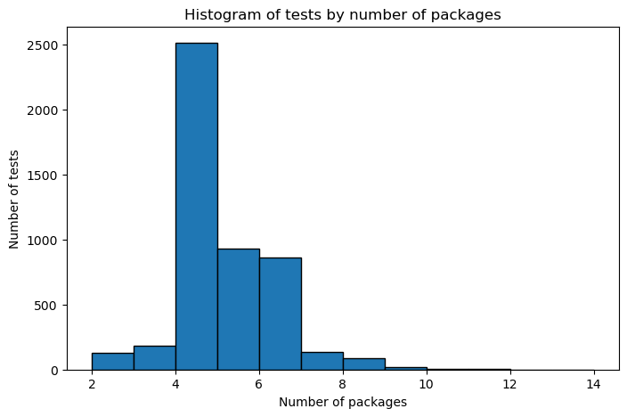
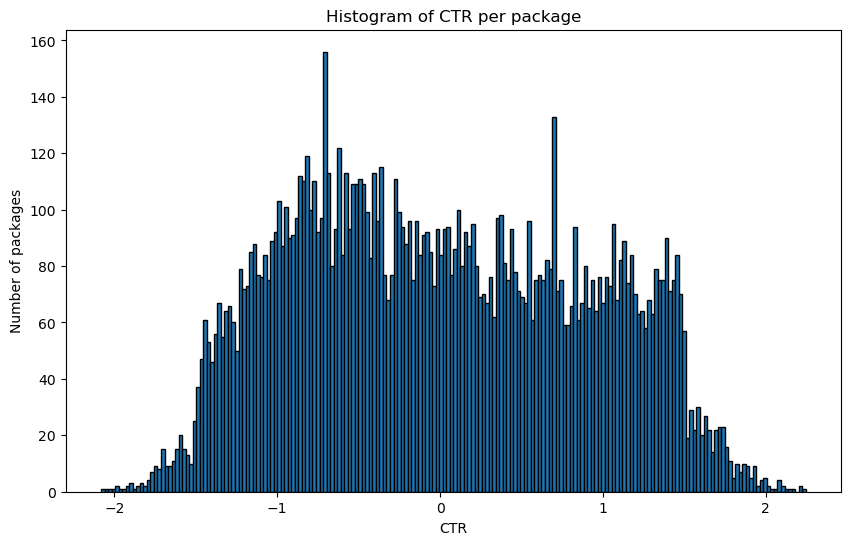

# MSML 641 NLP Project

Repository for the MSML 641 Natural Language Processing course Project - Fall 2025

## Table of Contents

- [Students](#students)
- [About the Project](#about-the-project)
- [1. Proposal - A/B Testing performance improvement based on NLP Techniques (A case for Upworthy Research Archive)](#1-proposal---ab-testing-performance-improvement-based-on-nlp-techniques-a-case-for-upworthy-research-archive)
  - [1.1. About the dataset](#11-about-the-dataset)
  - [1.2. About Upworthy](#12-about-upworthy)
- [2. Literature Review](#2-literature-review)
  - [2.1. Nate Matias Meta Analysis (2020)](#21-nate-matias-meta-analysis-2020)
  - [2.2. Negativity drives online news consumption (Robertson et al., 2023)](#22-negativity-drives-online-news-consumption-robertson-et-al-2023)
  - [2.3. Linguistic effects on news headline success: Evidence from thousands of online field experiments (Gligorić et al., 2023)](#23-linguistic-effects-on-news-headline-success-evidence-from-thousands-of-online-field-experiments-gligorić-et-al-2023)
  - [2.4. Reading dies in complexity: Online news consumers prefer simple writing (H Shulman et al., 2024)](#24-reading-dies-in-complexity-online-news-consumers-prefer-simple-writing-h-shulman-et-al-2024)
  - [2.5. Replacing an A/B Test with GPT (2023)](#25-replacing-an-ab-test-with-gpt-2023)
  - [2.6. Headline sentiment and topic effect on online user engagement (Ludwig Jonsson et al., 2021)](#26-headline-sentiment-and-topic-effect-on-online-user-engagement-ludwig-jonsson-et-al-2021)
  - [2.7. LOLA: LLM-Assisted Online Learning Algorithm (2024)](#27-lola-llm-assisted-online-learning-algorithm-2024)
- [3. Goals](#3-goals)
- [4. Exploratory Data Analysis](#4-exploratory-data-analysis)
  - [4.1. Results](#41-results)
- [5. Feature Engineering](#5-feature-engineering)
  - [5.1. Named-Entity Recognition](#51-named-entity-recognition)
  - [5.2. POS-based and basic text features](#52-pos-based-and-basic-text-features)
  - [5.3. Sentence style features](#53-sentence-style-features)
  - [5.4. Curiosity and intensity features](#54-curiosity-and-intensity-features)
  - [5.5. Sentiment Analysis](#55-sentiment-analysis)
  - [5.6. Dataset related features](#56-dataset-related-features)
  - [5.7. Readability features](#57-readability-features)
  - [5.8. Specificity feature](#58-specificity-feature)
- [6. Topic Modeling](#6-topic-modeling)
  - [6.1. Results](#61-results)
- [7. CTR Prediction with Traditional NLP Techniques](#71-ctr-prediction-with-traditional-nlp-techniques)
  - [7.1. Results](#71-results)
  - [7.2. Literature Confirmation/Rejection](#72-literature-confirmationrejection)
  - [7.3. CTR Prediction per Topic](#73-ctr-prediction-per-topic)
- [8. Headline Success Prediction with Traditional NLP Techniques](#8-headline-success-prediction-with-traditional-nlp-techniques)
  - [8.1. Key Findings](#81-key-findings)
  - [8.2. Strategic Implication for Phase 2](#82-strategic-implication-for-phase-2)
- [9. Headline Success Prediction with Embedding-based Techniques](#9-headline-success-prediction-with-embedding-based-techniques)

## Students

- Damian Calabresi
- Jaeyeol You
- Hersh Rajesh Chawla

## About the Project

**Presentation**

Presentation should be 5 to 10 minutes. Slides are in Google Drive.

Slides: [MSML 641 - Final Project - Presentation](https://docs.google.com/presentation/d/1Qnr1B8s1sDSrY4eUx64RpJNulDVDW3tmrYtxoSfJZyI/edit?usp=sharing)

**Report:**

Max 5 pages. No code. ACL Short Paper format. Code to generate the report is in the `report` folder.

[Report Paper](report/paper.pdf)

**Grading Rubric:**

Criterion:
- Problem Definition & Motivation (10 points): Clarity, originality, and grounding in NLP concepts.
- Methodology & Implementation (20 points): Soundness of approach, correctness, and reproducibility.
- Experimental Design (20 points): Use of appropriate baselines, datasets, and evaluation metrics.
- Results & Analysis (25 points): Quantitative rigor, qualitative insight, and linguistic interpretation.
- Presentation & Report Quality (10 points): Clarity, organization, figures/tables, and references.
- Reproducibility & Code Quality (10 points): Well-documented and runnable code; transparent methodology.
- Ethical Considerations (5 points): Awareness of limitations, fairness, and broader impact.
- Interface/API Bonus (Optional) (5 points): Functional demo, API, or visualization tool.

## 1. Proposal - A/B Testing performance improvement based on NLP Techniques (A case for Upworthy Research Archive)

### 1.1. About the dataset

**Upworthy Research Archive** is a dataset of headlines tested by Upworthy.com with simple A/B testing to measure the performance and "catchy" factor of different headlines for the same news articles.

[Upworthy Research Archive](https://upworthy.natematias.com/)

[Upworthy Research Archive - Research Paper](https://www.nature.com/articles/s41597-021-00934-7)

As cited from the website:
> "The Upworthy Research Archive is an open dataset of thousands of A/B tests of headlines conducted by Upworthy from January 2013 to April 2015."

It provides a list of news articles published, with different headlines tested for the same article. Each headline provides the number of impressions and clicks reached.

Upworthy Research Archive is a widely known dataset in the NLP and A/B Testing community, and it has been used in several research papers and projects.

The dataset contains other columns like excerpt and share link, which are not visible in the Upworthy website and are only for social media sharing, which is not covered by the A/B testing.

The goals of this project are to:
- Analyze the NLP techniques applied to predict the performance of a headline.
- Compare the performance of the different NLP techniques as well as the LLM-based ones.
- Try multiple classic NLP techniques ranging from bi-grams to BERT and evaluate their performance.
- Perform a cost-benefit analysis between the different NLP techniques and the LLM-based ones, as well as the possibility to use open-source or pre-trained models to reduce cost of the implementation.

Terminology:
- **Package**: Is a headline being tested. A record in the dataset. It's considered a package because sometimes the eyecather picture varies but the headline is the same.
- **Test**: Is a group of packages being tested. Correspond to one **article**, for which different headlines were tested in a randomized setup.

### 1.2. About Upworthy

Upworthy is a website that publishes news articles and videos. It became one of the biggest news websites in the United States around 2013/2014, known for the ability to create viral content and drive traffic to the website. It's popularity has been associated with the surge of Facebook and Twitter as social media platforms.

This is an Upworthy presentation about the methodology they applied to create viral content:

[Slideshare - How to make that one thing go viral? Just kidding!](https://www.slideshare.net/slideshow/how-to-make-that-one-thing-go-viral-just-kidding/15473996#1)

It's worth to mention that the previous Upworthy presentation is about **virality**, which means people sharing the news on social networks, and people's audience clicking on the link to read the news. This dataset doesn't contain information about news sharing in social networks and it's mostly focused on the clickability of the headlines for people visiting Upworthy's website.

## 2. Literature Review

The following is a list of research papers that apply NLP techniques to predict the performance of headlines using the Upworthy Research Archive dataset.

### 2.1. Nate Matias Meta Analysis (2020)

The creator of the Upworthy Research Archive dataset has done a meta analysis as part of his Princeton University course:

- [Github - Lecture 15 - Asking Questions of the Upworthy Archive](https://github.com/natematias/design-governance-experiments/blob/master/2020/lectures/Lecture%2015%20-%20Asking%20Questions%20of%20the%20Upworthy%20Archive.pdf)
- [Github - Lecture 15 - Jupyter Notebook](https://github.com/natematias/design-governance-experiments/blob/master/2020/lecture-code/lecture-17-meta-analysis.R.ipynb)

**Techniques applied:**
- De-meaning the data: The dataset contains the number of impressions and clicks for each headline. Comparing the click-rate between headlines in the dataset would be affected by the bias between articles. Some articles are more clickable than others (Or where published on different hours). To control for this bias, and do an intra-test comparison of the headlines, the mean of each test is substracted from the headline CTR.
- Test fixed-effects model: Test with models that are designed to do regression for differences within a group of items.
- Mix group-level variables: The author explains how variables which are constant within a test, should be included in the model. E.g. a factor that increases clickability may not be so effective if the test is run in a weekday.

### 2.2. Negativity drives online news consumption (Robertson et al., 2023)

- [Nature - Negativity drives online news consumption](https://www.nature.com/articles/s41562-023-01538-4)
- [Nieman Lab - Negative words in news headlines generate more clicks, but sad words are more effective than angry or scary ones](https://www.niemanlab.org/2023/03/negative-words-in-news-headlines-generate-more-clicks-but-sad-words-are-more-effective-than-angry-or-scary-ones/)

Summary of the research:

> Although positive words were slightly more prevalent than negative words, we found that negative words in news headlines increased consumption rates (and positive words decreased consumption rates). For a headline of average length, each additional negative word increased the click-through rate by 2.3%. Our results contribute to a better understanding of why users engage with online media.

**Techniques applied:**

- Text mining: Running text was converted into lower-case and tokenized, and special characters (that is, punctuations and hashtags) were removed.
- Sentiment analysis done on the basis of the Linguistic Inquiry and Word Count (LIWC). The LIWC contains word lists classifying words according to both a positive and negative sentiment.
- Gunning Fog index for text complexity score.
- Multilevel binomial regression

**Mutli-level binomial regression:**

Instead of applying a de-meaning to the headline CTR and then doing a linear regression, the authors of this paper applied a multi-level binomial regression to the data. This model defines a estimator which is better suited for the information provided by the dataset.

For the headline/package $i$ and the test $j$, the model is defined as:
$$
logit(p_{ij}) = \alpha_j+ \beta X_i
$$

With a different intercept coefficient alpha for each test and a set of coefficients beta for the features.

Then $p_{ij}$, which is the probability of the headline, is fitted to a binomial distribution where $n$ is the number of impressions (Already given) and $p_{ij}$ is the probability of the headline to be clicked. The probability distribution is then fitted to the data using maximum likelihood estimation or probabilistic programming.

### 2.3. Linguistic effects on news headline success: Evidence from thousands of online field experiments (Gligorić et al., 2023)

- [PLOS ONE - Linguistic effects on news headline success: Evidence from thousands of online field experiments](https://journals.plos.org/plosone/article?id=10.1371/journal.pone.0281682)

**Hypothesis**

- Is it possible to attribute headline success to the linguistic features of headlines?
- A: The presence of positive-emotion words is negatively associated with headline success.
- B: The presence of negative-emotion words is positively associated with headline success.
- Length is positively associated with headline success.
- Higher readability is negatively associated with headline success.

Eight hypotheses were tested in total. The authors concluded that the presence of negative-emotion words is positively associated with headline success. Length and the use of first-person singular words are also positively associated with headline success.

**Techniques applied:**

- Logistic regression
- Hypothesis word dictionaries for "indefinite article" category, first-person singular, etc.
- Linguistic Inquiry and Word Count (LIWC) for the positive and negative emotion categories.
- Flesch reading-ease score

### 2.4. Reading dies in complexity: Online news consumers prefer simple writing (H Shulman et al., 2024)

- [Science - Reading dies in complexity: Online news consumers prefer simple writing](https://www.science.org/doi/full/10.1126/sciadv.adn2555)

**Hypothesis:** Writing that requires less effort to read will tend to be approached, liked, and engaged with.

**Techniques applied:**

- 24-item SDT paradigm to measure the reading difficulty of the headlines.
- LWIC score for the readability of the headlines.

**Results:** Thousands of field experiments across traditional (i.e., The Washington Post) and nontraditional news sites (i.e., Upworthy) showed that news readers are more likely to click on and engage with simple headlines than complex ones.

### 2.5. Replacing an A/B Test with GPT (2023)

- [Count Bayesie - Replacing an A/B Test with GPT](https://www.countbayesie.com/blog/2023/3/23/replacing-an-ab-test-with-gpt)

**Hypothesis:** Can GPT predict the winner of an A/B test? Can AI replace A/B testing for headline selection to avoid waiting for results and wasting conversions on poor-performing variants?

**Techniques applied:**

- Three embedding approaches:
  - Bag-of-Words (bi-grams) with CountVectorizer
  - DistilBERT embeddings using Hugging Face Transformers library
  - GPT-3 embeddings using OpenAI embeddings API
- Logistic regression on the difference vector of embeddings (embedding_a - embedding_b)

**Results:** The author reached a 87% accuracy with the GPT-3 model on the test set. DistilBERT embeddings achieved an ~80% accuracy. Bag-of-Words basic method

### 2.6. Headline sentiment and topic effect on online user engagement (Ludwig Jonsson et al., 2021)

- [The Data Open - Headline sentiment and topic effect on online user engagement](https://rohitnag.xyz/files/Side%20Projects/DataOpenReport.pdf)

**Hypothesis**

The research main questions were:
- What is the relationship between sentiment and click rate?
- Which topics lead to a higher click rate?
- How do variations in headline phrasing (tone, subjectivity) affect user behavior?

The initial hypothesis was that headline content would have a significant effect on click rates, and that sentiment analysis could help identify the aspects responsible for causing increases in engagement.

**Techniques applied:**

- **TextBlob**: Sentiment analysis to compute polarity (-1 to 1) and subjectivity (0 to 1) of headlines
- **Latent Dirichlet Allocation (LDA)**: Topic modeling using Gensim library
- **GSDMM:** Gibbs Sampling algorithm for the Dirichlet Multinomial Mixture Model
- **Text Preprocessing**:
  - Convert to lowercase and expand contractions
  - Remove numerical values and English stop words
  - Remove words shorter than 1 character
  - Lemmatization and Stemming
  - Bag-of-Words vectorization

**Results:**

- **Sentiment Analysis**: The sentiment of headlines (polarity and subjectivity) has little to no effect on click rate. A weak negative trend was observed between polarity and click rate, suggesting that negatively polarized headlines resulted in slightly higher click rates, but the effect was not significant.
- **Image Analysis**: The choice of image affected user click rates by approximately 65% (top image performed 65% better than worst image in each group).
- **Topic Coherence**: The GSDMM model achieved acceptable coherence scores (0.46183) when using the top 5 words per topic, but lower scores with more words.

### 2.7. LOLA: LLM-Assisted Online Learning Algorithm (2024)

LOLA, integrates LLM predictions into a bandit algorithm. Found standalone LLM predictions were only slightly above chance, but LOLA outperformed traditional A/B tests and pure bandits in simulations.

[Marketing Science - LOLA: LLM-Assisted Online Learning Algorithm](https://pubsonline.informs.org/doi/10.1287/mksc.2024.0990)

[Arxiv - LOLA: LLM-Assisted Online Learning Algorithm](https://arxiv.org/pdf/2406.02611)

**Techniques applied:**

- LLM as a classifier with few and zero-shot prompting.
- LLM-based CTR prediction model using LoRA fine-tuning.
- LLM-Assisted 2-Upper Confidence Bounds (LLM-2UCBs): A modified version of the UCB algorithm where we can view the LLM's CTR prediction as auxiliary samples before the start of the online experiment.

**Results:** The experimentation test measured the regret, this means the difference between the best possible outcome and the outcome achieved by the algorithm. LOLA outperformed traditional A/B tests by 4-5% and pure bandits by 2-3% in simulations.

## 3. Goals

The goals of this project are to:

- Analyze and confirm the hypotheses found in the literature. Among them, confirm that negative sentiment, larger, and simpler headlines are positively associated with headline success.
- Compare prediction models based on traditional NLP techniques and LLM-based ones.

## 4. Exploratory Data Analysis

The following notebook contains the details of the exploratory data analysis: [1-exploratory-data-analysis.ipynb](1-exploratory-data-analysis.ipynb)

The exploratory data analysis gave us a better understanding of the dataset and the records that can be used.

We stored a cleaned version of the dataset in `dataset/processed/exploratory-packages-highest-ctr.csv`. In this dataset we only kept the Tests where different headlines were used in the A/B tests. In addition, a flag has been added to identify the Package with the highest CTR in the Test.

### 4.1. Results

**Number of Packages per Test**

Most of the articles tested contain between 4 and 6 packages. There are tests with up to 14 packages, but these may be exceptions. Some of these packages may contain the same headline test but different eyecatcher. Those packages were removed from further analysis.

**CTR De-meaning**

CTRs of different packages/headlines are not independent, each package is affected by confounders like the time of the day, the position in the website, and the content of the article. Within a test, the CTR of the packages are independent indeed, as this is the purpose of a randomized A/B test.

To make every package CTR comparable, we de-meaned the CTR by the mean and standard deviation of the test. This means that the CTR of each package is now compared to the average CTR of the test.

The histogram shows that the de-meaned CTR is centered around 0, with similar number of packages above and below 0, as expected.

**First Place and Winner**

The dataset defines these columns as:
- `first_place`: Shown to editors to guide decisions about what test to choose
- `winner`: Whether a package was selected by editors to be used on the Upworthy site after the test

We created a new feature named `is_highest_ctr` to identify the package with the highest CTR in the test. This is the real conclusion that can be drawn from the dataset.

## 5. Feature Engineering

After the exploration of the dataset has been done, the next step is to obtain new information from the dataset. The headline text is the main source of information, but the text alone would be difficult to analyze for a traditional predictor. Different features could be derived from the text, for example:
- Is famous person mentioned in the headline?
- Does the headline use a specific english tense?
- Does the headline includes a question?
- Nouns, verbs, words, and characters count.
- Sentiment analysis
- Readiness Complexity Score

[2-feature-engineering.ipynb](2-feature-engineering.ipynb)

### 5.1. Named-Entity Recognition

Named-entity recognition (NER) is the process of identifying and extracting named entities from text. We used SpaCy to extract the named entities from the headlines. From the detected entities we considered the ones tagged as Person, Organization, and Geo-political Entity. For each of these types we generated a boolean flag indicating if the headline mentions at least one entity of that type and a counter of those entities.

Listing the names of people tagged shows that most of them are already famous people so we didn't require any further filtering. A minimal set of words are identified as Person, Organization, or Geo-political Entity while they really aren't, but we consider those outliers don't represent a significant portion of the data.

The following features were generated: `headline_num_persons`, `headline_num_orgs`, `headline_num_gpes`, `headline_has_person`, `headline_has_org`, `headline_has_gpe`.

### 5.2. POS-based and basic text features

We also used SpaCy to extract the POS tags and identify different sentence characteristics that could potentially be useful for the analysis:

- `starts_with_verb`, `starts_with_pronoun`, `starts_with_number`: whether the first content token is a verb, pronoun, or number.
- `num_chars`, `num_tokens`, `avg_token_len`: basic length and tokenization statistics for the headline.
- `ends_with_qmark`, `ends_with_exclaim`: whether the headline ends with a question mark or exclamation mark.
- `has_quote`, `has_all_caps_word`: whether the headline contains any quote characters or a word in all caps.
- `num_nouns`, `num_verbs`, `num_adjs`, `num_advs`, `num_pronouns`: counts of nouns, verbs, adjectives, adverbs, and pronouns.

### 5.3. Sentence style features

One of the papers reviewed in the literature analyzed the sentence style of the headlines. We applied a custom approach to identify if the headline has an imperative style. It assumes that it's imperative if the root verb is in simple tense and there is no explicit subject related to it. We also leveraged the SpaCy library to identify the structure of the sentence. The following feature was generated: `headline_imperative_verb`.

### 5.4. Curiosity and intensity features

We came up with an approach to identify if the sentence expresses some intensity or curiosity. We identified a list of words commonly used in "curious" sentences or word that demonstrate intensity. Then we used the SpaCy embeddings simularity feature to identify is any of the words in the headline are similar to any of the words in the list. If they are, that similarity is indicated as the level of curiosity or intensity.

We also validate if the exact word is found in the headline to validate if the embeddings similarity approach helps or not.

The following features were generated: `headline_has_curiosity_word`, `headline_curiosity_similarity`, `headline_has_intensity_word`, `headline_intensity_similarity`.

### 5.5. Sentiment Analysis

The material "Negativity drives online news consumption (2023)" uses LIWC to analyze the sentiment of the headlines. LIWC is the most common method to analyze the sentiment of the text. We did research to understand how these methods work and found that LIWC is based on a sentiment dictionary and word counts. This makes it not very accurate for short texts like headlines. This is in fact mentioned in hte LIWC website:

> Because the meaning extraction method operates by analyzing word co-occurrences, extremely short texts have a tendency to add a lot of noise to our results. This is because a text with only two words ("I'm" and "hungry") does not provide a lot of information about how words tend to be used. Two words co-occur and all other words do not. In general, we recommend omitting texts with fewer than 10 words. If you are working with longer texts, you should consider setting this threshold higher (e.g., 100 words or even 1,000 words).

We used the VADER sentiment analysis tool from the NLTK library to analyze the sentiment of the headlines. VADER is a lexicon-based sentiment analysis tool that is designed to work with social media and short text in general. It makes focus on punctuation, capitalization, and word context in short sentences. Using this method, the following features were generated:
- `neg`: negative sentiment score.
- `neu`: neutral sentiment score.
- `pos`: positive sentiment score.
- `compound`: compound sentiment score (Varies from -1 to 1, where -1 is very negative, 0 is neutral, and 1 is very positive).

### 5.6. Dataset related features

We also generated some features that could be helpful in the prediction of the CTR: `created_at_dayofweek`, `created_at_hourofday`, `test_group_size`.

### 5.7 Readability features

We used the Flesch Reading Ease and Coleman–Liau index scores as two alternative readability measures. We applied both of them as Flesch Reading Ease score is based on the number of syllables in the words and it may not be very accurate for short texts like headlines. Coleman–Liau index is based on the number of characters per word and may be better for short texts.

The paper "Linguistic effects on news headline success: Evidence from thousands of online field experiments (2023)" uses the Flesch Reading Ease score to measure the readability of the headlines. We'll compare the results obtained with this method and the Coleman–Liau index.

The following features were generated: `read_flesch`, `read_coleman`.

### 5.8 Specificity feature

To calculate the specificity of the headline, first we generated a corpus based on the entire dataset. Then we used the Scikit-learn TF-IDF vectorizer to calculate the TF-IDF score for each headline and each word. The inclusion of infrequent words is supposed to increase the specificity of a headline compared to others. The result was stored in the feature `specificity_tfidf`.

## 6. Topic Modeling

To understand how different features affect the CTR we may also need to control for the topic of the headline, as different topics may have a different audience. We analyzed different algorithms for topic modeling.

**Latent Dirichlet Allocation (LDA)**

LDA (Latent Dirichlet Allocation) is an unsupervised topic modeling technique that used to identify the topics in a corpus of text. It is a Bayesian probabilistic model based on mixture of words. For this reason, it's fitted for large corpora of text and not well suited for short texts like headlines.

**GSDMM (Gibbs Sampling Dirichlet Multinomial Mixture)**

The logic behind this algorithm is explained by an analogy in one of the cited papers:

> Let us imagine that we are in a film class, where the students have to arrange themselves into groups according to their movie tastes. To simplify things, the professor asks them to quickly write down a couple of the movies they have recently watched. Now each student is effectively labeled with a preliminary, albeit imperfect, list of movies that represent their taste. The clustering algorithm then works as follows: the professor will randomly assign the students to K different tables (categories). In the next step, the students will move, with certain probability, to a different table. The probability of moving will depend on two things: the size of the table, and the movie interests of the student in such table. Essentially, the bigger the table, and the more similar the taste, the more likely for a student to make the move.

This algorithm is based on clustering, and it assumes each text belongs to one out of K topics. It's better suited for short texts like headlines.

**BERTopic**

BERTopic is the state-of-the-art topic modeling technique. It uses BERT embeddings to represent the text. It's pipeline is defined by these steps:

- Embedding: BERT embeddings are used to represent the text.
- Dimensionality reduction: UMAP is used to reduce the dimensionality of the embeddings.
- Clustering: HDBSCAN is used to cluster the embeddings.
- Tokenization: At the end of the clustering we have an embedding for each headline and the cluster they belong to, but this is not the topic itself. We need to analyze the words on each cluster. For this reason, we need to tokenize the headlines text.
- Weighting Scheme: Now, we need to assign a weight to each word in the cluster. Usually this is done using c-TF-IDF.
- Representation Tuning: This stage is optional and we're not going to use it. The idea behind this step is to take the bag-of-words and represent it as a consolidated topic. Otherwise the topic is just a list of words with frequencies.

The algorithm is better explained by the maintainers of the Python library:

[BERTopic - The Algorithm](https://maartengr.github.io/BERTopic/algorithm/algorithm.html)

We chose to use BERTopic for topic modeling as it's the state-of-the-art technique and its practical for small datasets.

The topic modeling notebook is [3-topic-modeling.ipynb](3-topic-modeling.ipynb).

### 6.1. Results

50% of the headlines where assigned to a topic. The list of topics is saved in `dataset/processed/topics.csv`.

Based on the top words of each topic, we titled the first 18 topics as follows:

- –1: Miscellaneous
- 0: She, He, Pronouns
- 1: Kids
- 2: Food & Restaurants
- 3: Racism
- 4: Gay Marriage
- 5: Feminism
- 6: Science & Medicine
- 7: Pets & Animals
- 8: Music
- 9: Crime
- 10: Water & City
- 11: Guns & Wars
- 12: Money & Economy
- 13: Fashion
- 14: Climate Change
- 15: Space
- 16: Viral Videos & Content
- 17: Men (He, Him, His)
- 18: Future & Predictions

### 7.1. CTR Prediction with Traditional NLP Techniques

CTR prediction has been done using a linear regression in the following notebook:
[4-ctr-prediction.ipynb](4-ctr-prediction.ipynb)

#### 7.1.1. Results

The analysis of the engineered features and their statistical significance gave us the following results:

- **Named entities**: There is no correlation with the CTR.
- **Sentence starting, Question/Exclamation features**: Headlines starting with a verb, with question or exclamation marks are associated with a lower CTR, this isn't something we expected.
- **Basic text features**: Definitively there is a correlation with the num of pronouns.
- **Sentence style**: A mild correlation with the use of specific intensity words.
- **Sentiment**: Contrary to what we expected, based on the reviewed literature, there is no correlation with the sentiment of the headline at all.
- **Specificity**: The use of specific words is associated with a decrease in the CTR.

These results were obtained doing a linear regression over the engineered features in the exploratory and confirmatory datasets. Regressions were run for all the features simultaneously and then for groups of features to avoid multicollinearity issues.

P-value and confidence interval for each feature taken as relevant:

| Feature                      | coef     | std err | t      | P-value | [0.025   | 0.975]  |
|------------------------------|----------|---------|--------|-----------------|----------|---------|
| starts_with_verb             | -0.0679  | 0.012   | -5.615 | 0.000           | -0.092   | -0.044  |
| starts_with_pronoun          | 0.0254   | 0.009   | 2.869  | 0.004           | 0.008    | 0.043   |
| num_pronouns                 | 0.0228   | 0.004   | 6.131  | 0.000           | 0.016    | 0.030   |
| ends_with_qmark              | -0.1967  | 0.013   | -14.93 | 0.000           | -0.223   | -0.171  |
| ends_with_exclaim            | -0.2211  | 0.037   | -5.953 | 0.000           | -0.294   | -0.148  |
| headline_has_intensity_word  | 0.0315   | 0.011   | 2.890  | 0.004           | 0.010    | 0.053   |
| headline_intensity_similarity| 4.5559   | 2.082   | 2.188  | 0.029           | 0.475    | 8.636   |
| neg                          | 26.4455  | 15.158  | 1.745  | 0.081           | -3.265   | 56.156  |
| neu                          | 26.3195  | 15.159  | 1.736  | 0.083           | -3.392   | 56.031  |
| pos                          | 26.1057  | 15.159  | 1.722  | 0.085           | -3.607   | 55.818  |
| compound                     | 0.0085   | 0.032   | 0.265  | 0.791           | -0.054   | 0.071   |
| specificity_tfidf            | -0.5161  | 0.061   | -8.496 | 0.000           | -0.635   | -0.397  |

#### 7.3. CTR Prediction per Topic

In the notebook [5-topic-modeling-ctr-prediction.ipynb](5-topic-modeling-ctr-prediction.ipynb) we ran a linear regression for each topic separately. The results are not statistically significant for any of the topics due to the small number of headlines per topic.

#### 7.2. Literature Confirmation/Rejection

Two published and peer-reviewed papers confirmed that a negative sentiment is associated with a higher CTR. Those methods use LIWC for sentiment analysis which, as explained before (And it's confirmed in the LIWC website) are not good for short texts like headlines. When applying VADER sentiment analysis to the headlines, the correlation is not statistically significant.

This is of upmost importance given that the article "Negativity drives online news consumption (Robertson et al., 2023)" was published in Nature, has been peer reviewed, cited multiple times, and this outcome has been in news sites. We found peer reviewed validations of this research but they don't discuss the accuracy of LWIC to measure the negativity and positivity of the headlines.

### 8. Headline Success Prediction with Traditional NLP Techniques

We conducted a rigorous benchmark using state-of-the-art Traditional NLP methods, testing various strategies to handle the extreme class imbalance (95% Losers vs. 5% Winners).

#### 8.1. Key Findings
1.  **Sensitivity to Class Weights:**
    * When we applied a high class weight (~18.5), the model **over-predicted** winners (10,000+), sacrificing precision.
    * When we reduced the weight (to 10), the model became **too conservative**, predicting almost zero winners (only 9).
    * This "Swing" phenomenon proves that the model **cannot distinguish** true winners from losers; it merely biases its guessing strategy based on the weight.

2.  **The "Random Guess" Baseline:**
    * Across all experiments, the **ROC-AUC score remained stagnant near 0.5 (0.54)**.
    * This quantitatively confirms that **headline success is NOT linearly correlated with surface-level linguistic features** (TF-IDF, sentiment, readability).

#### 8.2. Strategic Implication for Phase 2

**"Why do we need LLMs?"**
This failure is our most important insight. It demonstrates that the "Curiosity Gap"—the psychological trigger that drives clicks—is a **semantic nuance** invisible to traditional statistical models.
* **Traditional NLP:** Counts words (e.g., "Does 'video' appear?").
* **Generative AI (LLM):** Understands intent (e.g., "Does this headline create a burning question in the reader's mind?").

**Therefore, this benchmark provides the definitive data-driven justification for our team's transition to GPT-based approaches.**

### 9. Headline Success Prediction with Embedding-based Techniques

In the notebook [7-predicting-headline-success-embedding.ipynb](7-predicting-headline-success-embedding.ipynb) we used embeddings to predict the success of a headline.

The process compared two minimal embedding models:
- All-MiniLM-L6-v2
- BAAI/bge-base-en-v1.5

The results were:
- All-MiniLM-L6-v2: 60% accuracy
- BAAI/bge-base-en-v1.5: 63% accuracy

The embedding obtained for each headline were transformed into a difference vector and this vector was used to train a Linear Regression and a Neural Network. The difference between those two models was minimal.

From the experiments we can conclude that even simple embedding models provide a better result than traditional NLP techniques, and the embedding technique as well as the model is more important in the result than the machine learning model used.